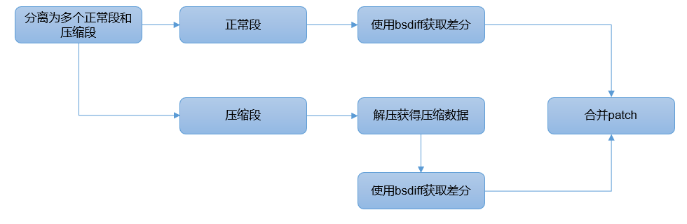

# proj17-ota-based-on-bsdiff
### 项目名称
基于bsdiff差分算法的OS升级架构

### 项目描述

该项目，主要基于bsdiff开源差分算法，实现文件之间的差分数据生成，以及差分数据融合，主要用于系统的OTA（Over
The Air）。bsdiff开源算法目前广泛用于嵌入式设备的升级业务，但相关算法只能解决基本的一些功能，如非压缩文件的差分，和差分适配，但是对于压缩文件，以及小内存设备不能直接使用，需要做算法的升级。

综上，本课题主要研究差分工具的编写，支持压缩文件，数据的差分制作。并实现差分数据的适配，需要为小内存设备做考虑，如小于128KB的RAM设备。同时支持出错后的分区数据回滚。

### 所属赛道

2021全国大学生操作系统比赛的“OS功能设计”赛道

### 参赛要求

- 以小组为单位参赛，最多三人一个小组，且小组成员是来自同一所高校的本科生（2021年春季学期或之后本科毕业的大一~大四的学生）
- 如学生参加了多个项目，参赛学生选择一个自己参加的项目参与评奖
- 请遵循“2021全国大学生操作系统比赛”的章程和技术方案要求

### 项目导师

**祝继和**

* github 

* email zhujh0423@thundersoft.com

### 难度

中等

### 特征

-   升级异常处理，如出错回滚处理

-   小内存设备升级，如小于128KB RAM

-   支持gz，lz4，gzip等多种压缩算法

-   支持数据签名与校验

-   对于压缩文件实现差分，对于包含压缩数据的文件获取差分

### 文档

[bsdiff](https://github.com/mendsley/bsdiff)

### 平台实现注意事项

-   需要考虑代码的可移植性，支撑Ubuntu等Linux系统，亦可以移植到非Linux系统上

-   升级的核心层使用C++/C进行编码，优先使用C++

-   工具类相关的实现，优先采用python

-   需要考虑对多种文件系统的支持，如：ext4，fatfs，fat32，f2fs

### License

[The MIT License](https://opensource.org/licenses/MIT)

## 预期目标

### 注意：下面的内容是建议内容，不要求必须全部完成。选择本项目的同学也可与导师联系，提出自己的新想法，如导师认可，可加入预期目标

### 第一题：实现差分工具

-   差分数据制作工具：提供工具制作出镜像、文件的差分数据。
-   需要实现gz，lz4，gzip等压缩包的差分数据生成。

* 需要针对包含压缩数据的文件进行差分数据生成

### 第二题：系统数据更新

-   系统数据更新：以升级服务为主体，面向升级数据（升级包）开展工作，主要负责将升级包中的数据写入设备中对应的分区中，并执行升级包中预制的升级命令。关键交付点为差分升级能力。

-   支持128KB小内存设备的差分数据更新。

-   支持异常出错后的系统回滚。